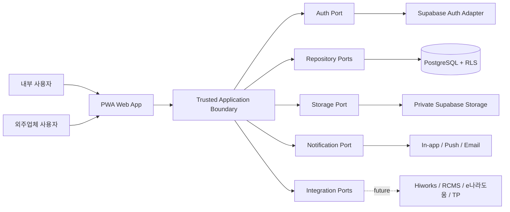
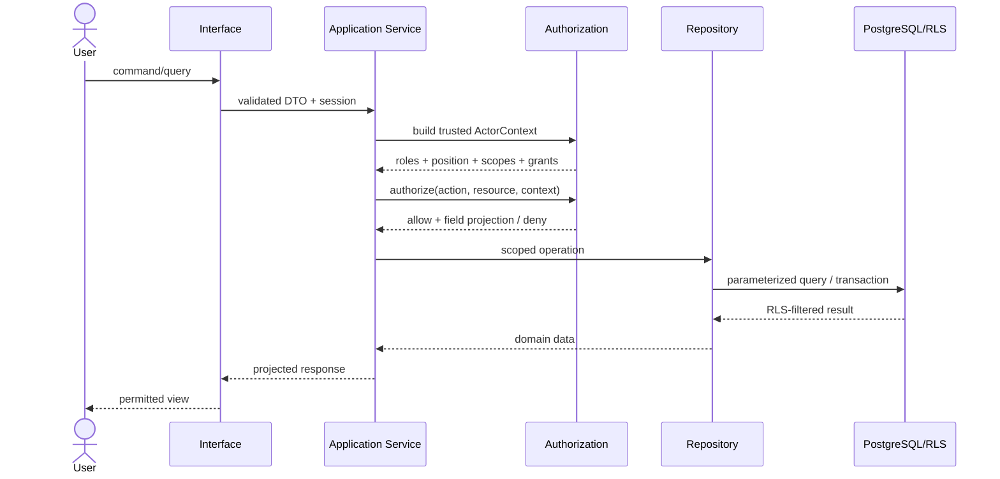

# Architecture

## 1. 결정 요약

본 시스템은 약 30명 규모에 맞춘 **모듈러 모놀리스(modular monolith)** 로 시작한다. 한 배포 단위 안에서도 Core와 Feature Module, 도메인과 공급자 Adapter를 분리한다. 초기 인프라는 Supabase Auth/PostgreSQL/Storage를 사용하지만, 화면이나 도메인 규칙이 Supabase SDK에 직접 결합되지 않게 한다.

핵심 결정 ID:

| ID | 결정 |
|---|---|
| `ARC-001-MODULAR-MONOLITH` | 독립 마이크로서비스가 아닌 모듈러 모놀리스로 시작한다. |
| `ARC-002-HEX-BOUNDARY` | Interface → Application → Domain 방향으로 의존하고 Infrastructure가 Port를 구현한다. |
| `ARC-003-SERVER-AUTHZ` | 권한·Scope·필드 노출·상태전이는 신뢰된 서버 경계에서 검사한다. |
| `ARC-004-RLS-DEFENSE` | Postgres RLS를 2차 방어선으로 적용한다. |
| `ARC-005-NO-UI-SUPABASE` | UI에서 업무 테이블·Storage를 Supabase SDK로 직접 호출하지 않는다. |
| `ARC-006-IMMUTABLE-EVIDENCE` | 승인본·확정 연구노트·감사이력은 append-only/immutable 규칙을 갖는다. |
| `ARC-007-OFFLINE-ALLOWLIST` | 오프라인 기능은 허용된 명령만 로컬 Outbox에 저장한다. |
| `ARC-008-PROVIDER-PORTS` | Auth, Storage, Notification, Integration을 Port/Adapter로 분리한다. |
| `ARC-009-TYPED-WORKFLOW` | 상태와 전이를 명시적으로 모델링하고 자유 문자열 상태를 금지한다. |
| `ARC-010-TRANSACTIONAL-AUDIT` | 업무 전이, 전이이력, 감사이벤트를 하나의 DB 트랜잭션으로 기록한다. |
| `ARC-011-NEXT-APP-ROUTER` | Next.js App Router + TypeScript, 기본 Node.js runtime을 Web/BFF 기준으로 채택한다. |
| `ARC-012-SQL-FIRST-MIGRATION` | Supabase CLI의 검토 가능한 SQL migration을 DB 정본으로 사용한다. |

## 2. 시스템 컨텍스트



`Trusted Application Boundary`는 Next.js App Router의 기본 Node.js 서버 런타임이다. 내부 조회는 Server Component에서 Application Service를 호출하고, UI mutation은 Server Action, 외부 API·Webhook·PWA sync endpoint는 Route Handler를 사용한다. 브라우저는 표시용 공개키를 사용한 Auth 세션 처리 외에 핵심 업무 DB를 직접 조작하지 않는다.

## 3. 계층과 의존성

```text
interface/
  web, route handlers, server actions, API DTO, presenters
application/
  use cases, authorization service, transaction boundary, ports
domain/
  aggregates, entities, value objects, policies, transitions, events
infrastructure/
  supabase auth, postgres repositories, storage, mail/push, integrations
```

의존 규칙:

- Domain은 Next.js, React, Supabase, HTTP, Storage SDK를 import하지 않는다.
- Application은 Domain과 Port만 안다.
- Infrastructure는 Application Port를 구현한다.
- Interface는 사용자 입력을 검증하고 Use Case를 호출하지만 정책을 복제하지 않는다.
- DB enum/check/foreign key/RLS는 도메인 규칙의 방어선이며 유일한 규칙 저장소가 아니다.
- 공급자 교체는 Adapter 교체를 목표로 하며 PostgreSQL의 관계형 무결성을 억지로 추상화하지 않는다.

## 4. 모듈 구조

### Core

| 모듈 ID | 책임 | 금지 |
|---|---|---|
| `core.identity` | User, Organization, Department, Position, Role, Permission | 업무 승인권 자동 추론 금지 |
| `core.authorization` | ActorContext, Scope, policy evaluation, field projection | UI 메뉴를 권한 근거로 사용 금지 |
| `core.approval` | ApprovalPolicy, Instance, Step, Participant, delegation | 문서 본문을 직접 소유하지 않음 |
| `core.document` | Template, Document, DocumentVersion, rendering, retention | 승인본 덮어쓰기 금지 |
| `core.file` | Attachment metadata, hash, private delivery | 장기 공개 URL 저장 금지 |
| `core.audit` | append-only security/business audit events | 일반 CRUD 수정/삭제 금지 |
| `core.notification` | in-app/push/email outbox and preferences | 업무 상태의 원본이 되지 않음 |
| `core.sync` | offline command allowlist, outbox, conflict record | last-write-wins 금지 |
| `core.codes` | 안정된 코드/표시 라벨, 정책 버전 | 핵심 상태를 임의 문자열로 추가 금지 |

### Feature Modules

| 모듈 ID | 핵심 Aggregate |
|---|---|
| `feature.project` | Product, Project, ProjectMember, WbsNode, Requirement |
| `feature.quality` | TestPlan, TestResult, Inspection, InspectionAttempt, NCR, CAR |
| `feature.vendor` | Vendor, VendorUser, ProjectScope |
| `feature.contract` | VendorContract, ContractMilestone, Deliverable, Guarantee, WarrantyIssue |
| `feature.change` | ChangeRequest(ECR), ChangeOrder(ECO) |
| `feature.purchase` | Supplier, Item, BOM, PurchaseRequest, PurchaseResolution, Receipt, PurchaseInspection |
| `feature.rnd` | RndProgram, Budget, Expenditure, Evidence, Deadline |
| `feature.research-note` | ResearchNote, correction/addendum, evidence export |
| `feature.safety` | SafetyManagerAssignment, SafetyInspection, Training, HazardousMaterial, WasteLog, Drill, Incident |
| `feature.allowance` | ProjectAllowancePolicyVersion, eligibility/tax snapshots, evaluation, calculation decision, payroll export reference |
| `feature.tech-copy` | L3/L4 controlled print rendering, numbered copy, handover, return/destruction evidence |

Feature 간 직접 테이블 수정은 금지한다. 예를 들어 검수 합격이 지급 가능 상태에 영향을 주면 `InspectionAccepted` 도메인 이벤트를 Application 계층이 받아 ContractMilestone Use Case를 호출한다.

## 5. 요청 처리와 권한



목록 허용과 상세 허용을 분리한다. 특히 외주 계약 목록 DTO에는 금액·지급 필드가 존재하지 않는다. 상세 조회는 `contract.detail.finance.read` 권한과 정확한 vendor/contract Scope를 모두 만족할 때만 해당 필드를 투영한다.

M03의 request composition은 Supabase가 서버에서 검증한 subject/expiry/session/AAL만 인증 증거로 사용하고, Role·Position·Vendor·Scope는 user metadata나 request body가 아니라 현재 DB 레코드에서 다시 구성한다. 검증된 subject의 서버 snapshot은 ordinary request role이 호출할 수 없는 전용 NOBYPASSRLS `youone_identity_resolver` 경계에서만 읽는다. 검증 팩토리가 만든 명목상 `TrustedActorContext`만 request PostgreSQL UnitOfWork에 전달할 수 있다. Supabase request adapter와 privileged service/secret adapter는 서로 다른 export이며, web request interface는 privileged adapter를 import할 수 없다.

Authorization은 boolean만 반환하지 않는다. 결정에는 stable reason, 사용한 Scope/assignment evidence, 서버가 등록한 projection profile ID/version, audit·재인가·step-up 같은 obligation을 포함한다. 실제 Project/Contract/DocumentVersion FK가 생기기 전에는 generic resource UUID Scope table을 만들지 않으며, M05/M06/M07 migration이 typed FK와 RLS를 함께 추가한다.

Actor, Resource Context, Projection은 모두 factory provenance를 런타임에 검증한다. Feature의 Resource loader가 DB에서 resource ID와 실제 Vendor/Project/Contract/DocumentVersion 관계, workflow/security 판정, Approval participant evidence를 함께 읽는다. 외주 조회는 exact Project/Contract Scope와 action-bound Vendor projection이 없으면 거부하며, owner 또는 Organization Scope를 우회 근거로 사용하지 않는다.

Identity/RBAC 변경은 일반 table write로 열지 않는다. 계정·업체 비활성화와 Vendor membership 부여/회수는 trusted request time, 현재 권한, optimistic version을 검사하고 상태 변경과 M02 Audit을 같은 transaction에 기록하는 guarded function만 사용한다. Acting authority ID도 transaction context에 전달하고 DB가 authenticated/effective actor, 기간, 회수, action set, 공식 승인 role을 재검증한다.

## 6. 데이터와 트랜잭션

- PostgreSQL이 업무 정본이다.
- 각 mutable aggregate root는 `version_no`를 두고 optimistic concurrency를 적용한다.
- 상태전이는 현재 상태와 `version_no`를 조건으로 갱신한다.
- 전이와 `state_transition_history`, `audit_log`, notification outbox를 같은 트랜잭션에서 기록한다.
- M02는 aggregate/action/event/state-machine/state/transition의 빈 registry 구조만 제공한다. 각 업무 migration이 자기 stable code를 등록하며 M02가 미래 업무 상태나 PostgreSQL enum을 임의로 선도입하지 않는다.
- Audit은 stable reason/reference와 before/after hash만 저장하고 범용 JSON payload를 두지 않는다. Outbox JSON은 schema ID/version이 있는 최소 envelope만 허용하며 업무 원문, 전체 before/after row, token, URL, evidence bytes, SQL/stack을 복제하지 않는다.
- 금액은 통화코드와 정밀 Decimal/Numeric으로 저장한다.
- 업무 날짜와 타임스탬프를 구분한다. 타임스탬프는 UTC로 저장한다.
- JSON은 DocumentVersion 편집기 콘텐츠, 공급자 응답 snapshot, 정책 파라미터 중 스키마가 명시된 부분에만 제한적으로 사용한다.
- 승인, 계약, WBS, 검수, NCR/CAR, ECR/ECO의 식별자·관계·상태·책임자는 정규 컬럼/테이블로 저장한다.

## 7. 파일과 문서

- Attachment DB 레코드와 Storage 객체를 분리한다.
- 필수 메타데이터: `storage_provider`, `storage_key`, `mime_type`, `size_bytes`, `sha256`, `version_no`, `security_level`, `created_by`, `created_at`.
- 파일은 private bucket에 저장하고 권한검사 후 짧은 만료의 전달 URL 또는 서버 프록시로 제공한다.
- 기술자료의 미리보기·다운로드 요청은 grant 상태와 조건을 검사하고 성공/실패를 감사한다.
- L3/L4 외부 전달은 원문 파일이나 수신자 자체 출력이 아니라 내부 서버가 생성한 사본번호별 워터마크 PDF를 내부 권한자가 직접 출력하는 파이프라인을 거친다.
- 출력물 인계, 수령확인, 회수/파기와 승인 인스턴스를 `technical_document_copy`에 기록한다. L3는 연구소장, L4는 연구소장+대표 승인 없이는 렌더링·출력할 수 없다.

## 8. Approval과 Document 결합

- 업무 모듈은 자유 문자열 subject를 전달하지 않는다. 공개 `TypedApprovalSubjectPort`를 구현하고 exact typed FK, version, checksum snapshot을 Approval Engine에 전달한다.
- Approval Instance는 결재선 snapshot과 정책 version을 보존한다.
- 결재 명령은 domain mutation, exact subject 재검증, optimistic save, append-only action/audit/outbox, subject outcome을 하나의 application UnitOfWork에서 처리한다.
- 최종 승인 시 adapter가 exact subject version을 immutable outcome으로 전환한다.
- 반려 후 수정은 새 DocumentVersion을 만든다.
- 회수·반려 후 재상신은 이전 Instance를 보존하고 새 generation으로 연결한다. subject adapter는 같은 업무 root와 더 높은 새 immutable version을 검증한다.
- Approval Engine은 계약·구매·기술자료 접근·기술문서 삭제 등 여러 업무가 재사용하지만 각 도메인의 전이조건을 대신하지 않는다.

M04는 순환 의존 없이 엔진 자체를 승인하기 위한 최초 typed adapter로 `APPROVAL_POLICY_VERSION`을 물리 구현한다. M05는 `DOCUMENT_VERSION` exact composite FK와 Document-owned adapter를 추가하며 Approval Core 내부나 generic polymorphic subject table을 확장하지 않는다. 개인 결재함·상세 및 문서함·상세 화면은 query/command adapter가 연결되지 않으면 가짜 빈 결과나 실행 가능한 버튼을 만들지 않고 명시적 unavailable 상태를 반환한다.

M05의 파일 전달은 `core.file`의 trusted authorization과 `infrastructure.supabase-storage`의 일회성 broker를 통과한다. 브라우저는 Storage SDK, bucket/key 또는 provider signed URL을 직접 받지 않는다. PostgreSQL은 content hash와 봉인 manifest를 다시 계산하고, Supabase Storage 스키마가 존재할 때 `PRIVATE_BUSINESS` 비공개 bucket과 restrictive object policy를 설치한다. 일반 PostgreSQL CI에서는 이 conditional provider branch를 계약 검사하며 실제 Supabase 환경 smoke test는 별도 운영 Gate로 남긴다.

M06는 `features.project`가 Project/WBS 순수 규칙과 application port를 소유하고, `processes.formal-research-designation`이 Project 신청본과 Approval Core의 exact typed subject를 조합한다. Approval Core는 Project 내부 엔티티나 저장소를 import하지 않으며 Project UI도 Supabase SDK나 table에 직접 접근하지 않는다. 일반 Project와 정식 연구과제 지정을 분리하고, formal status는 immutable designation query에서만 파생한다. query adapter가 아직 조립되지 않은 화면은 가짜 빈 목록이나 실행 가능한 명령 대신 명시적 unavailable 상태를 표시한다.

M07는 `features.vendor`와 `features.contract`가 Vendor/Contract/Deliverable 규칙과 application port를 소유한다. ContractVersion은 Approval Core에 exact typed subject adapter로 연결되지만 Approval Core가 Contract 내부 저장소나 엔티티에 의존하지 않는다. Vendor 목록·기본 상세·금융 상세은 서로 다른 public DTO와 DB projection이며, 금융 상세은 기본 DTO에 optional 필드를 추가하는 방식으로 우회하지 않는다. Contract Scope의 생성·회수는 계약 application service가 요청하고 Platform transaction이 상태·감사·outbox와 원자적으로 저장한다.

## 9. PWA와 오프라인

오프라인 허용 명령:

- 할 일 snapshot 조회.
- 체크리스트 작성.
- 검수 초안.
- 사진/메모 임시저장.
- 허용된 과업 진행상태 변경 명령.
- 현장기록 초안.

온라인 전용:

- 결재·합의·전결·대결.
- 역할/권한/Scope 변경.
- L2~L4 외부 기술자료 접근 및 민감 원문 열람.
- 기술문서 삭제 승인.
- 계약 체결/해지와 지급확정 같은 고위험 전이.

로컬에는 IndexedDB 기반 `offline_outbox`와 최소 캐시만 둔다. 명령에는 `command_id`, `aggregate_id`, `base_version`, `created_at`, `payload_schema_version`을 포함한다. 서버 version이 다르면 `SYNC_CONFLICT`를 만들고 자동 적용하지 않는다.

## 10. 배포 구조

### 초기 권장

- Web/Application: Node.js 호환 Next.js App Router 배포.
- DB/Auth/File: Managed Supabase.
- Background worker: 별도 worker 프로세스 또는 검증된 scheduler/queue adapter.
- Environments: local, staging, production 분리.
- Observability: 구조화 로그, request/actor correlation ID, error monitoring, security audit.
- Backup: DB와 Storage manifest를 함께 검증하는 복구훈련.

### 온프레미스 경로

첫 이전 후보는 PocketBase 재작성보다 **PostgreSQL 데이터 모델을 유지하는 self-hosted Supabase 또는 표준 PostgreSQL + 대체 Auth/Storage Adapter** 다. Supabase 공식 문서는 Docker self-hosting을 지원하지만 운영·보안·백업·HA 책임이 사용자에게 있다고 명시한다. 따라서 온프레미스 전환은 단순 설정 변경이 아니라 별도 운영 프로젝트로 취급한다.

## 11. 승인된 기술스택 기준

사용자가 2026-08-21 추천 기술스택 진행을 승인했다. 의존성의 정확한 버전은 스캐폴딩 시 공식 지원범위와 lockfile로 고정한다.

`M01` 초기 lock 기준은 Node.js `24.19.0` LTS, pnpm `11.19.0`, Next.js `16.3.2`, React `19.2.8`, TypeScript `5.9.3`, Turborepo `2.10.11`, Vitest `4.1.11`이다. ESLint는 Next.js 간접 플러그인의 선언된 peer 범위를 지키기 위해 `9.39.5`로 고정하며, 플러그인이 ESLint 10을 공식 지원한 뒤 별도 upgrade 검증을 수행한다.

| 영역 | 채택 기준 | 이유 | 경계/조건 |
|---|---|---|---|
| Web/BFF | Next.js App Router + TypeScript | 반응형 UI와 trusted server boundary를 한 코드베이스에서 운영 가능 | React SPA + Fastify/NestJS는 API 조직 분리가 더 중요할 때 |
| UI | React + 접근성 있는 headless component primitives + CSS tokens | 모바일/데스크톱 공통 디자인 시스템 | 특정 UI kit는 시안 검토 후 선택 |
| Validation | Zod 또는 동등한 schema validator | DTO와 offline payload version 검증 | 서버/클라이언트 schema 생성전략 검토 |
| DB | PostgreSQL | 관계·무결성·트랜잭션·RLS가 핵심 요구에 적합 | PocketBase는 후속 대안이나 복잡한 관계/RLS 재설계 비용이 큼 |
| Backend provider | Supabase Auth/Postgres/Storage | 사용자 지정 초기 인프라와 일치 | self-hosted Supabase 또는 독립 Adapter 조합 |
| Data access | 명시적 Repository + SQL/migration layer | 공급자 SDK 누수 방지와 정밀한 쿼리/트랜잭션 | ORM은 migration/enum/RLS/SQL 검토가 가능한 도구만 선정 |
| Editor | Tiptap JSON schema editor | 표·이미지·체크리스트·확장 node와 snapshot 저장 가능 | 실시간 협업은 P0 제외; schema version 필수 |
| Offline | Service Worker + IndexedDB/Dexie + 자체 sync protocol | 허용 명령, outbox, conflict UI를 명시적으로 통제 | 범용 양방향 sync 제품은 사용하지 않음 |
| Test | Vitest + Playwright + Postgres/RLS integration tests | 도메인·브라우저·DB 정책을 모두 검증 | 동일 범위를 만족하는 대안 가능 |
| Runtime | Next.js 기본 Node.js runtime | DB, 암호화, 파일 렌더링과 패키지 호환성 | 명확한 지연 요구와 호환성 검증 없이는 Edge 사용 금지 |
| Package/DB change | pnpm + Supabase CLI SQL migrations | 재현 가능한 lockfile과 RLS/constraint 검토 | ORM 생성 migration이 정본 SQL을 우회하면 안 됨 |

현재 공식 문서 기준으로 Next.js는 App Router를 최신 기능 경로로 안내하고 PWA 가이드를 제공한다. Supabase는 공개 스키마 테이블의 RLS 사용과 Storage RLS를 공식적으로 지원한다. Dexie는 브라우저 IndexedDB wrapper다. 이 근거와 사용자의 F.1 결정으로 기술 방향은 확정됐으며, 버전 고정은 구현 Gate 후 수행한다.

공식 참고:

- [Next.js App Router](https://nextjs.org/docs/app)
- [Next.js 설치 및 현재 요구사항](https://nextjs.org/docs/app/getting-started/installation)
- [Supabase Row Level Security](https://supabase.com/docs/guides/database/postgres/row-level-security)
- [Supabase Storage Access Control](https://supabase.com/docs/guides/storage/security/access-control)
- [Supabase Self-Hosting](https://supabase.com/docs/guides/self-hosting)
- [Dexie.js documentation](https://dexie.org/docs)
- [Tiptap editor documentation](https://tiptap.dev/docs/editor/getting-started/overview)

## 12. Accepted Architecture Decision Records

- `ADR-001`: workspace and module boundaries.
- `ADR-002`: SQL-first repositories and migrations.
- `ADR-003`: typed Approval subject links and adapters.
- `ADR-004`: request DB principal and transaction-local ActorContext.
- `ADR-005`: Tiptap editor schema and rendering versions.
- `ADR-006`: worker runner and transactional outbox.
- `ADR-007`: Dexie offline allowlist and conflict records.
- `ADR-008`: L3/L4 controlled-copy watermark and custody.

## 13. Architecture Gate Checks

- Supabase imports are confined to infrastructure and narrowly scoped session helpers.
- Vendor access is tested at application and RLS layers.
- Approval, DocumentVersion, WBS, Contract, Inspection, NCR/CAR, ECR/ECO remain typed domain objects.
- All core state transitions are enumerated in `docs/state-machines.md`.
- Offline command allowlist excludes sensitive operations.
- No long-lived public Storage URL exists.
- Provider adapters never bypass domain authorization merely because they hold service credentials.
