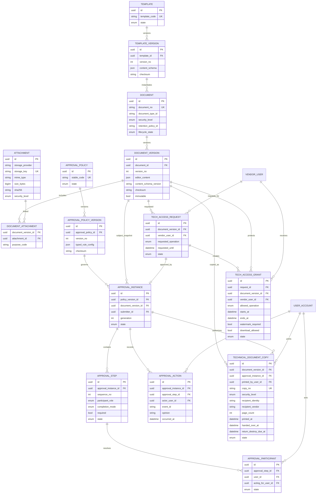
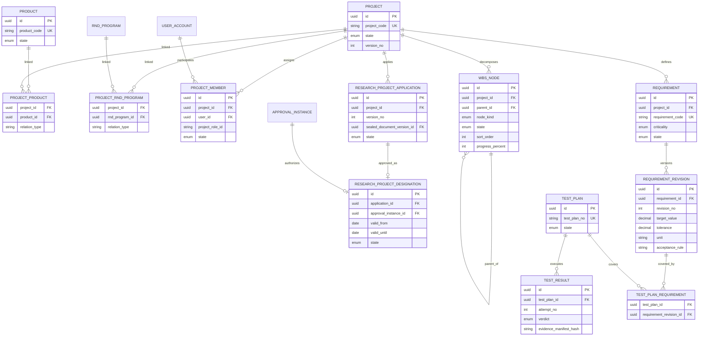
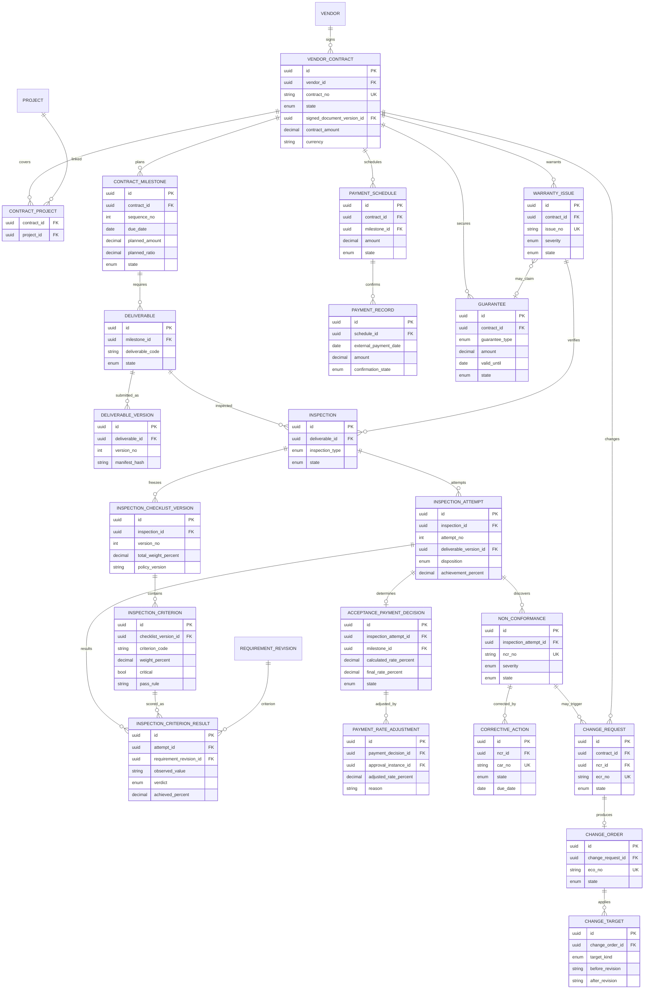
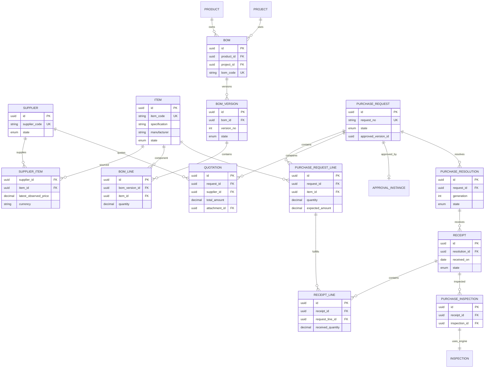
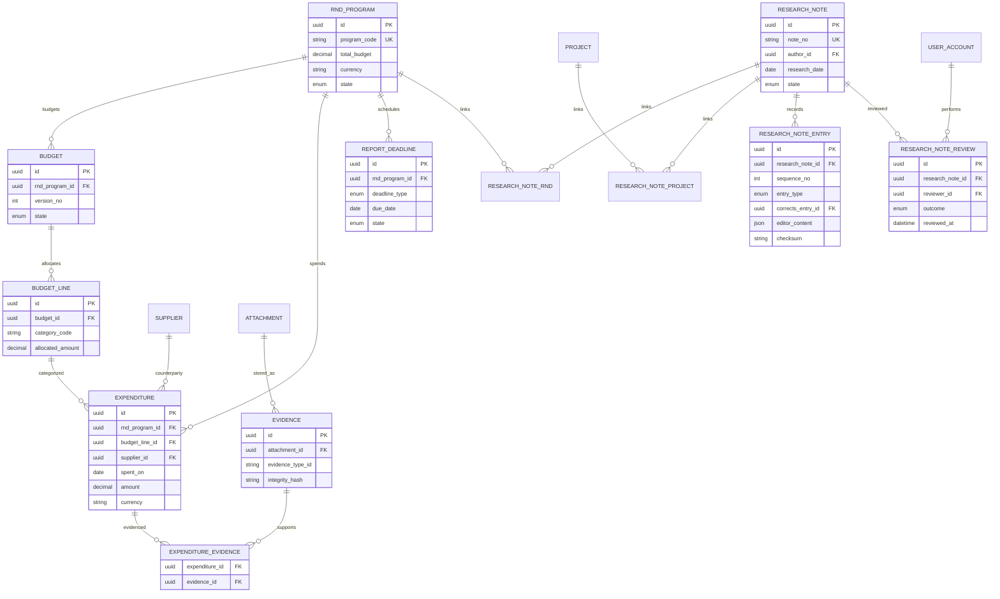
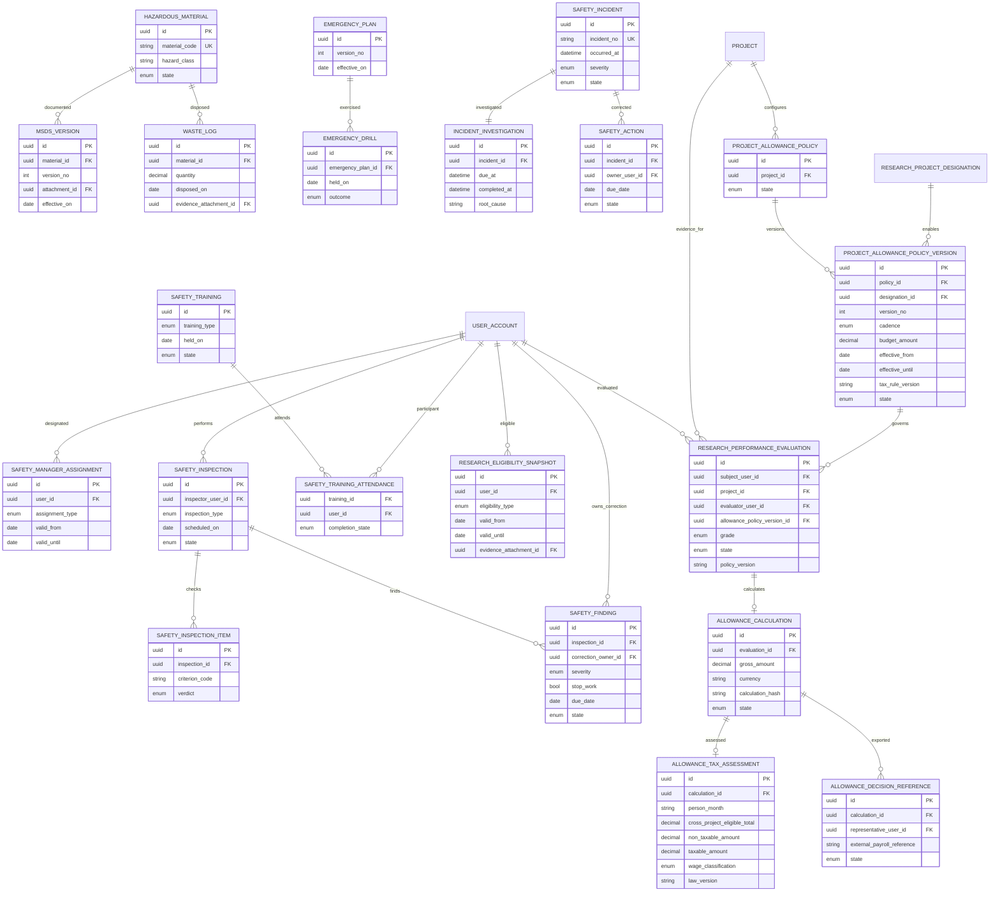
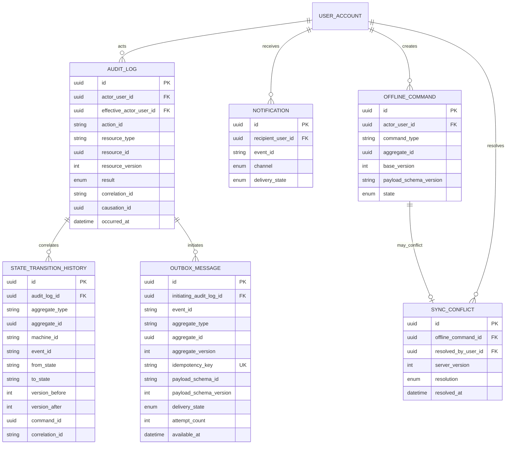

# Logical ERD

## 1. Conventions

- Logical design only; physical types, indexes, partitioning, and migration syntax follow after Gate approval.
- `id` values are UUIDs. Human numbers are alternate unique keys.
- Every mutable aggregate root includes `version_no`, `created_at`, and `updated_at` even where omitted from diagrams.
- State columns use reviewed enum/check/state-definition IDs from `docs/state-machines.md`, never unconstrained text.
- All money uses amount plus currency.
- Soft deletion is not a universal substitute for retention/disposal lifecycle.
- Polymorphic foreign keys are avoided for protected business links; typed join tables preserve referential integrity.

## 2. Identity, Role, and Scope

```mermaid
erDiagram
  ORGANIZATION ||--o{ DEPARTMENT : contains
  USER_ACCOUNT ||--o{ USER_ORGANIZATION_ASSIGNMENT : assigned
  ORGANIZATION ||--o{ USER_ORGANIZATION_ASSIGNMENT : bounds
  USER_ACCOUNT ||--o{ USER_DEPARTMENT_ASSIGNMENT : assigned
  DEPARTMENT ||--o{ USER_DEPARTMENT_ASSIGNMENT : bounds
  USER_ACCOUNT ||--o{ USER_POSITION_ASSIGNMENT : assigned
  POSITION ||--o{ USER_POSITION_ASSIGNMENT : bounds
  USER_ACCOUNT ||--o{ USER_ROLE_ASSIGNMENT : has
  ROLE ||--o{ USER_ROLE_ASSIGNMENT : assigned
  ROLE ||--o{ ROLE_PERMISSION_ASSIGNMENT : contains
  PERMISSION ||--o{ ROLE_PERMISSION_ASSIGNMENT : grants
  USER_ACCOUNT ||--o{ USER_SECURITY_ENTITLEMENT_ASSIGNMENT : has
  SECURITY_ENTITLEMENT ||--o{ USER_SECURITY_ENTITLEMENT_ASSIGNMENT : grants
  VENDOR ||--o{ VENDOR_USER : has
  USER_ACCOUNT ||--o{ VENDOR_USER : joins
  AUTHORIZATION_ACTION_SET ||--o{ AUTHORIZATION_ACTION_SET_VERSION : versions
  AUTHORIZATION_ACTION_SET_VERSION ||--o{ AUTHORIZATION_ACTION_SET_PERMISSION : contains
  PERMISSION ||--o{ AUTHORIZATION_ACTION_SET_PERMISSION : allows
  FIELD_PROJECTION_PROFILE ||--o{ FIELD_PROJECTION_PROFILE_VERSION : versions
  FIELD_PROJECTION_PROFILE_VERSION ||--o{ FIELD_PROJECTION_FIELD : includes
  USER_ACCOUNT ||--o{ ACTING_AUTHORITY_ASSIGNMENT : authenticates
  AUTHORIZATION_ACTION_SET_VERSION ||--o{ ACTING_AUTHORITY_ASSIGNMENT : limits
  USER_ACCOUNT ||--o{ PROJECT_SCOPE : granted
  PROJECT ||--o{ PROJECT_SCOPE : bounds
  USER_ACCOUNT ||--o{ CONTRACT_SCOPE : granted
  VENDOR_CONTRACT ||--o{ CONTRACT_SCOPE : bounds

  ORGANIZATION {
    uuid id PK
    string legal_name
    enum status
  }
  DEPARTMENT {
    uuid id PK
    uuid organization_id FK
    uuid parent_id FK
    string stable_code UK
  }
  POSITION {
    uuid id PK
    string stable_code UK
    int approval_rank
  }
  USER_ACCOUNT {
    uuid id PK
    string auth_subject UK
    enum account_kind
    enum status
    datetime valid_from
    datetime valid_until
  }
  ROLE {
    uuid id PK
    string stable_code UK
  }
  PERMISSION {
    uuid id PK
    string stable_code UK
  }
  USER_ROLE_ASSIGNMENT {
    uuid id PK
    uuid user_id FK
    uuid role_id FK
    datetime valid_from
    datetime valid_until
    datetime revoked_at
  }
  ROLE_PERMISSION_ASSIGNMENT {
    uuid id PK
    uuid role_id FK
    uuid permission_id FK
    datetime valid_from
    datetime valid_until
    datetime revoked_at
  }
  SECURITY_ENTITLEMENT {
    uuid id PK
    string stable_code UK
    enum status
  }
  USER_SECURITY_ENTITLEMENT_ASSIGNMENT {
    uuid id PK
    uuid user_id FK
    uuid entitlement_id FK
    datetime valid_from
    datetime valid_until
    datetime revoked_at
    bigint version_no
  }
  VENDOR {
    uuid id PK
    string vendor_code UK
    enum status
  }
  VENDOR_USER {
    uuid id PK
    uuid vendor_id FK
    uuid user_id FK
    enum status
    datetime valid_from
    datetime valid_until
    datetime revoked_at
  }
  AUTHORIZATION_ACTION_SET_VERSION {
    uuid action_set_id FK
    int version_no
    datetime valid_from
    datetime valid_until
  }
  AUTHORIZATION_ACTION_SET_PERMISSION {
    uuid action_set_id FK
    int action_set_version FK
    uuid permission_id FK
  }
  FIELD_PROJECTION_PROFILE_VERSION {
    uuid profile_id FK
    int version_no
    enum actor_kind
    string resource_type
    string action_id
    datetime valid_from
    datetime valid_until
  }
  FIELD_PROJECTION_FIELD {
    uuid profile_id FK
    int profile_version FK
    string field_id
  }
  ACTING_AUTHORITY_ASSIGNMENT {
    uuid id PK
    uuid authenticated_user_id FK
    uuid effective_actor_user_id FK
    uuid role_id FK
    uuid action_set_id FK
    int action_set_version FK
    datetime valid_from
    datetime valid_until
  }
  PROJECT_SCOPE {
    uuid id PK
    uuid vendor_user_id FK
    uuid project_id FK
    uuid action_set_id FK
    int action_set_version FK
    datetime valid_until
    enum state
  }
  CONTRACT_SCOPE {
    uuid id PK
    uuid vendor_user_id FK
    uuid vendor_contract_id FK
    uuid action_set_id FK
    int action_set_version FK
    datetime valid_until
    enum state
  }
```

M03 physically creates Identity/RBAC, Vendor/VendorUser, acting-authority, normalized action-set, and named field-projection records. `PROJECT_SCOPE`, `CONTRACT_SCOPE`, and exact DocumentVersion grant records remain logical extension points until M06, M07, and M05 can create them with their real typed FK targets and RLS in the same migration. M03 must not substitute a generic `(resource_type, resource_id)` grant table.

M04 physically creates `APPROVAL_POLICY`, immutable/sealed `APPROVAL_POLICY_VERSION`, normalized step/participant policy rules, `APPROVAL_INSTANCE`, snapshotted `APPROVAL_STEP`/`APPROVAL_PARTICIPANT`, append-only `APPROVAL_ACTION`, and the bootstrap typed link `APPROVAL_SUBJECT_POLICY_VERSION`. The typed link uses exact version/checksum composite FKs; later subject adapters are added only with their real aggregate FKs. Policy-rule ownership cannot be reparented to bypass a sealed version, and resubmission requires the same subject root plus a strictly newer sealed version.

M05 physically creates normalized `TEMPLATE`/`TEMPLATE_VERSION`, `DOCUMENT`/`DOCUMENT_VERSION`, `ATTACHMENT`, logical `DOCUMENT_ATTACHMENT` history, content-validation/seal/scan evidence, and `APPROVAL_SUBJECT_DOCUMENT_VERSION`. Exact composite FKs bind template snapshots, validation checksum, sealed manifest evidence, scan evidence and approval subject version/checksum/sealed-at. `DOCUMENT_VERSION.security_level_snapshot` prevents a later Document-head downgrade from weakening a historical L3/L4 version. FORCE RLS and column grants exclude raw editor content, object coordinates and evidence tables; SECURITY DEFINER commands are the only write/content-delivery path.

M06 physically creates `PRODUCT`, `PROJECT`, `PROJECT_MEMBER`, `PROJECT_PRODUCT_LINK`, self-referencing `WBS_NODE`, and exact-FK `PROJECT_VENDOR_GRANT`. Formal designation uses `RESEARCH_PROJECT_APPLICATION_ROOT`, immutable/versioned `RESEARCH_PROJECT_APPLICATION_VERSION`, normalized team/output/evidence children, exact `APPROVAL_SUBJECT_RESEARCH_PROJECT_APPLICATION`, and immutable `RESEARCH_PROJECT_DESIGNATION`. Formal status is a derived projection, never an editable Project column. RLS and command functions require active internal membership or the exact active Vendor membership + Project grant; Vendor projections omit unreviewed fields.

M07 physically creates `VENDOR_CONTRACT`, immutable `CONTRACT_VERSION`, `CONTRACT_PROJECT`, structured `CONTRACT_MILESTONE`, `DELIVERABLE`/`DELIVERABLE_VERSION`, `GUARANTEE`, `WARRANTY_ISSUE`, exact-FK `CONTRACT_VENDOR_GRANT` and `APPROVAL_SUBJECT_CONTRACT_VERSION`. Contract list-safe, basic-detail and finance-detail projections are separate database contracts. The safe projections never select finance/payment/internal-evaluation columns; finance requires an exact active Vendor membership/grant and finance action. Activation and terminal Contract transitions update grants with audit/transition/outbox atomically.

M08 physically creates `REQUIREMENT`/immutable `REQUIREMENT_REVISION`, versioned `TEST_PLAN` with exact revision coverage, immutable `TEST_RESULT` evidence, `INSPECTION`, immutable `INSPECTION_CHECKLIST_VERSION`/`INSPECTION_CRITERION`, numbered immutable `INSPECTION_ATTEMPT`/`INSPECTION_CRITERION_RESULT`, typed residual-condition/partial-usable-portion children, `ACCEPTANCE_PAYMENT_DECISION`, `PAYMENT_RATE_ADJUSTMENT`, and exact-FK `APPROVAL_SUBJECT_ACCEPTANCE_PAYMENT_DECISION`. Calculated, proposed, adjusted and final rates are separate columns. No payment-transfer or accounting table/function is introduced.

## 3. Document, File, Approval, and Technical Access

Document business links are typed join tables, for example `PROJECT_DOCUMENT`, `CONTRACT_DOCUMENT`, `RND_DOCUMENT`, `PURCHASE_DOCUMENT`, `INSPECTION_DOCUMENT`, and `RESEARCH_NOTE_DOCUMENT`.

## 4. Project, WBS, Requirement, and R&D Links

## 5. Vendor Contract, Deliverable, Inspection, Quality, Change, and Warranty

`CHANGE_TARGET` is a controlled change index, not permission to store all changed entities in JSON. Physical design should add typed target join tables where FK enforcement is required.

## 6. Purchase, Supplier, Item, BOM, Receipt, and Inspection

## 7. R&D, Evidence, and Research Note

Expenditure may use typed join tables such as `EXPENDITURE_PROJECT`, `EXPENDITURE_CONTRACT`, and `EXPENDITURE_PURCHASE`; it must not use an unchecked generic foreign ID.

## 8. Safety and Research Allowance Evidence

These allowance records support project-policy calculation and evidence-backed tax classification. They export a payroll reference but do not perform payroll or transfer funds.

## 9. Audit, Notification, and Offline Sync

M02 physical tables keep actor/effective-actor UUID snapshots without a `USER_ACCOUNT` FK until M03 and never use cascading evidence deletion. Audit and transition rows are insert-only. Outbox identity, event body, schema, correlation, and idempotency fields are immutable after insert; protected worker operations may change only lease/retry/delivery fields. Business state/action/event definitions are registered by their owning feature migration, not pre-populated by M02.

## 10. Required Physical Constraints

To be defined in migrations after approval:

- unique `(document_id, version_no)`, `(template_id, version_no)`, `(inspection_id, attempt_no)`, `(approval_instance_id, sequence_no)`;
- no update/delete on approved/finalized version rows except controlled retention path;
- check constraints for valid dates, nonnegative quantities/amounts, ratio bounds where a ratio is used;
- foreign keys for all typed joins;
- partial unique constraints for active memberships/scopes as needed;
- RLS on exposed tables and Storage metadata;
- append-only protection for ApprovalAction, AuditLog, StateTransitionHistory, finalized ResearchNoteEntry, and accepted InspectionAttempt;
- immutable Outbox envelope fields with separately controlled lease/retry/delivery updates;
- unique state transition result `(aggregate_type, aggregate_id, version_after)` and outbox idempotency key;
- registered stable-code FKs/checks for machine, event, from/to state, action, result, and delivery state;
- indexes supporting exact vendor/project/contract scope checks and expiry scans;
- exclusion or validation rules preventing overlapping contradictory grants;
- idempotency uniqueness for background expiry, notification, and offline commands.

## 11. Explicit Anti-Patterns

- `business_object(data jsonb, status text)` for all modules.
- `approval_history jsonb` embedded in Document.
- WBS stored only as nested JSON.
- Contract terms, payment milestones, inspections, NCR/CAR, or ECR/ECO stored only in editor content.
- Generic attachment or document links without FK-backed subject tables where integrity matters.
- Vendor security implemented by `vendor_id` query parameters or UI filtering.
- Mutable approved document content.
