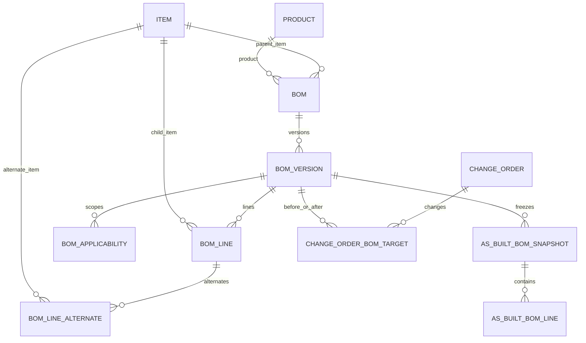
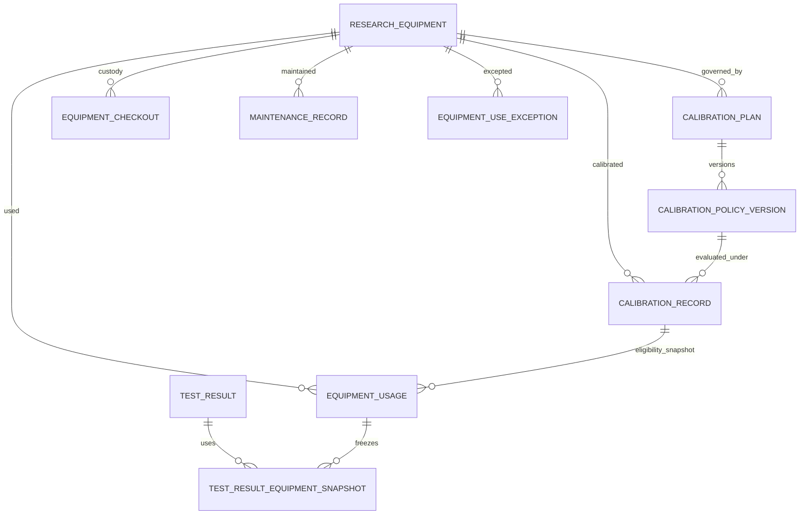
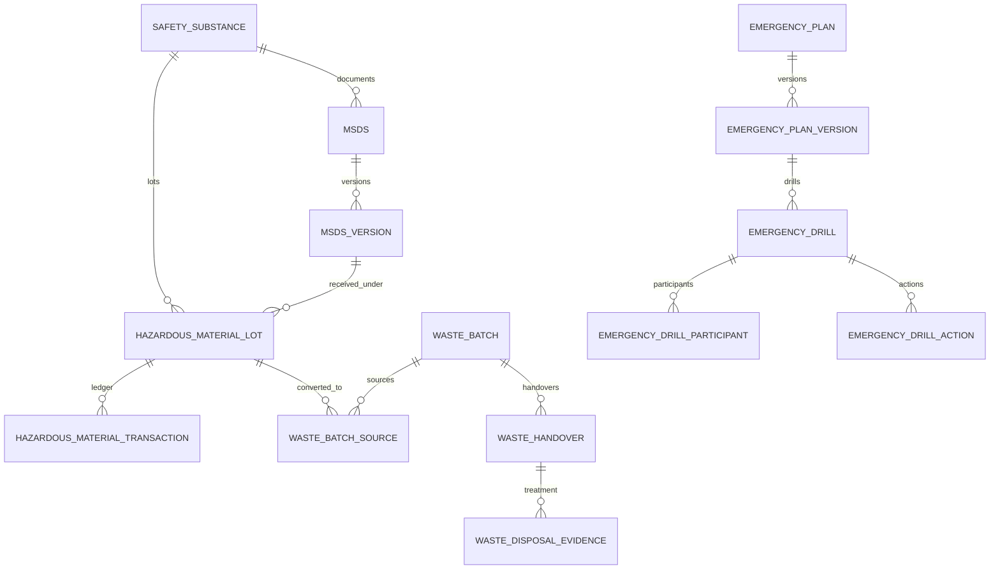
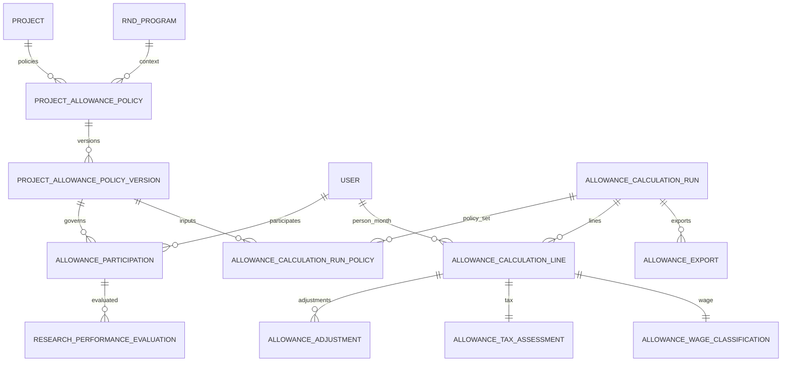
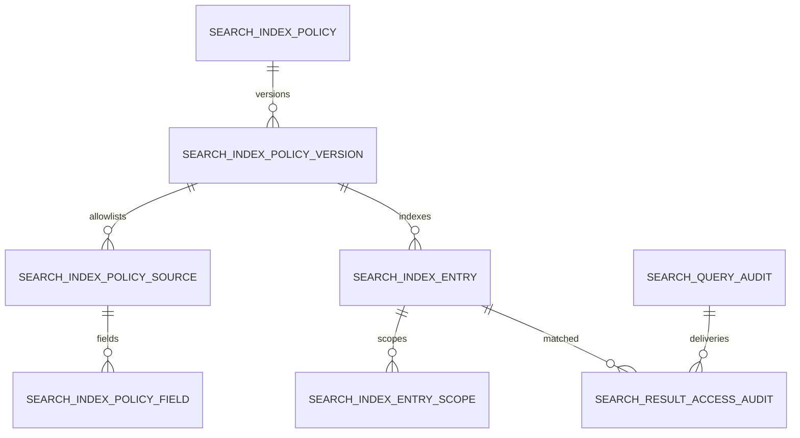

# P1 Logical ERD Delta

- 문서 ID: `P1-ERD-DELTA-V0.1`
- 상태: `APPROVED_DESIGN`
- 추적 이슈: GitHub `#48`
- 주의: 논리 모델이며 P1 Development Gate 전 migration/table 생성 근거가 아니다.

## 1. 공통 relational 규칙

- PK는 UUID, timestamp는 UTC, human number/code는 alternate unique key다.
- lifecycle state는 reviewed stable code FK/check와 optimistic `version`을 사용한다.
- polymorphic business relation은 하나의 `target_type + target_id`로 축약하지 않고 typed link table 또는 reviewed discriminator+exclusive FK check를 사용한다.
- 승인본/evidence/transition/audit는 update/delete 금지 또는 guarded correction-only 정책을 사용한다.
- JSON은 비핵심 renderer/config snapshot에만 허용하며 BOM line, calibration, material ledger, allowance line, search Scope를 JSON 하나로 저장하지 않는다.

## 2. BOM 관계

| Table | 핵심 column/FK | 필수 constraint |
|---|---|---|
| `bom` | `id`, `bom_no`, nullable `product_id`, nullable `parent_item_id`, owner org | product/item 중 exact one 또는 reviewed dual ownership check; `bom_no` unique |
| `bom_version` | `bom_id`, `version_no`, state, checksum, sealed/approved/effective timestamps, predecessor | `(bom_id, version_no)` unique; predecessor same Bom; `RETURNED`/approved/effective sealed version immutable |
| `bom_line` | `bom_version_id`, line no, `child_item_id`, item revision, quantity/unit, sort | `(bom_version_id,line_no)` unique; quantity > 0; parent-child cycle 검증 |
| `bom_line_alternate` | line, alternate item/revision, priority, effective interval | original item과 다름; interval/priority conflict 방지 |
| `bom_applicability` | version, scope kind, typed Project/Product/serial/lot/time columns | scope kind별 allowed FK/field exact-one check |
| `as_built_bom_snapshot` | DeliverableVersion/InspectionAttempt, BomVersion, checksum, sealed_at | source tuple immutable; same subject/snapshot no duplicate |
| `as_built_bom_line` | snapshot, source BomLine, actual Item/revision/lot/serial | snapshot checksum에 포함, append-only |
| `change_order_bom_target` | ChangeOrderVersion, before/after BomVersion, applicability checksum | same Bom lineage, exact before/after typed FK |

## 3. Equipment/Calibration 관계

| Table | 핵심 column/FK | 필수 constraint |
|---|---|---|
| `research_equipment` | equipment no, model/serial, owner/location/custodian, serviceability state/version | equipment no unique; retired row 재활성 금지; custody/usage state를 이 column에 저장 금지 |
| `calibration_plan` | equipment, calibration kind, current policy version | `(equipment,kind)` unique active plan |
| `calibration_policy_version` | plan, version/state/predecessor, trigger/cadence, alert, method/provider criteria, source basis, checksum/effectivity | `RETURNED`/approved/effective row immutable; predecessor same plan; overlapping effective interval 금지 |
| `calibration_record` | equipment, policy version, performed/issued/valid dates, result, certificate Attachment/hash | equipment snapshot/hash immutable; pass일 때만 valid interval |
| `equipment_usage` | equipment, usage state/version, Project/WBS, operator user/vendor, start/end, CalibrationRecord/Exception, purpose | operator exact-one; start 시 serviceability/calibration eligibility guarded; `OUT_OF_SERVICE` 후에도 end 허용 |
| `equipment_checkout` | equipment, checkout state/version, handover/recipient/return tuple, condition/evidence | open checkout partial unique per equipment; `OUT_OF_SERVICE` 후에도 return 허용 |
| `maintenance_record` | equipment, work order, provider, start/end, result/evidence | completion 이후 immutable |
| `equipment_use_exception` | equipment, Project/TestPlan, purpose, interval, restriction, Approval snapshot | active approved policy/Approval; interval bounded; exact resource |
| `test_result_equipment_snapshot` | TestResult, EquipmentUsage, equipment/calibration/exception checksum | finalized TestResult와 함께 immutable |

## 4. Safety 확장 관계

| Table | 핵심 column/FK | 필수 constraint |
|---|---|---|
| `safety_substance` | stable substance code, names, hazard class, Supplier/Item link | substance code unique; classification typed |
| `msds`, `msds_version` | substance/language, version/state/predecessor/source/checksum, issued/effective, Attachment | same substance/language/effectivity overlap 금지; `RETURNED`/approved/effective row immutable |
| `hazardous_material_lot` | substance, exact received MSDSVersion, lot, quantity unit, location, expiry, state/version | lot alternate unique; quantity unit fixed after ledger 시작 |
| `hazardous_material_transaction` | lot, transaction type, quantity, from/to location, Project/Vendor, actor, evidence | append-only; signed quantity/type check; balance < 0 금지 |
| `waste_batch` | waste no/class, quantity/unit, location, state/version, source basis | waste no unique; sealed 후 source/quantity immutable |
| `waste_batch_source` | waste batch, material lot/transaction, converted quantity | source quantity 합계와 batch seal checksum 일치 |
| `waste_handover` | batch, carrier/handler typed parties, handed over by/at, evidence | batch별 current handover lineage; party identity/provenance 필수 |
| `waste_disposal_evidence` | handover, method/facility, treated_at, certificate Attachment/hash, verifier | handover와 분리; 확인 후 immutable |
| `emergency_plan_version` | scope, scenario, response/role/contact/checklist typed children, Approval/effectivity | approved/effective row immutable; scope interval overlap 금지 |
| `emergency_drill` | plan version, schedule/actual, facilitator, state/version, result checksum | effective PlanVersion만 시작 가능 |
| `emergency_drill_participant` | drill, internal/vendor participant typed FK, required/attendance | participant exact-one, duplicate 금지 |
| `emergency_drill_action` | drill/finding, owner, due, completion/verification evidence | verifier와 owner/performer 독립성 policy 적용 |

Emergency plan의 연락망/역할/checklist는 검색이 필요한 typed child table로 정규화하고 전체 plan을 하나의 JSON field로 저장하지 않는다.

## 5. Research Allowance 관계

| Table | 핵심 column/FK | 필수 constraint |
|---|---|---|
| `project_allowance_policy` | Project, optional RndProgram, policy no | exact Project; RndProgram은 Project link 존재 |
| `project_allowance_policy_version` | version/state/predecessor/checksum, period/cadence, evaluation/calculation/adjustment rules, ApprovalPolicyVersion/source | effective interval overlap 금지; `RETURNED`/approved/effective immutable |
| `allowance_participation` | policy version, User, period/ratio/role/evidence | interval/ratio validation; Project/R&D employment evidence |
| `research_performance_evaluation` | participation, period, evaluator, item scores/evidence, sealed total/grade | evaluator assignment, sealed 이후 immutable |
| `allowance_calculation_run` | period/person-month aggregation key, state/version, predecessor run, policy-set checksum | `(calculation_month, run_revision)` unique; `RETURNED`/approved run immutable |
| `allowance_calculation_run_policy` | run, exact policy version | policy set checksum 구성 |
| `allowance_calculation_line` | run, User, Project, participation/evaluation, base/calculated/final amount | `(run,user,project)` unique; amount numeric/check constraints |
| `allowance_adjustment` | line, before/after amount, reason, proposer, Approval evidence | append-only; final rate/amount bounds from policy |
| `allowance_tax_assessment` | line, source version, eligible/non-taxable/taxable amount, rationale | line당 versioned assessment; amount reconciliation |
| `allowance_wage_classification` | line, classification, source version, reviewer/rationale | tax assessment와 독립 FK/decision |
| `allowance_export` | run, export no, template/renderer, Attachment/hash, recipient/delivery evidence | approved run checksum exact; export no unique; 지급 field 없음 |

## 6. Search 관계

| Table | 핵심 column/FK | 필수 constraint |
|---|---|---|
| `search_index_policy_version` | version/state/predecessor/checksum/effectivity, actor/security policy, tokenizer/snippet/purge SLA | `RETURNED`/approved/effective version immutable; placeholder scope 금지; typed Approval subject 필수 |
| `search_index_policy_source` | policy version, source stable type, ProjectionProfile ID/version | source/profile unique |
| `search_index_policy_field` | source row, field stable ID, index mode metadata/body, snippet flag | security/field allowlist; L3/L4 body check deny |
| `search_index_entry` | source stable type/UUID/version, policy version, security, content checksum, state/version/index/purge times | `(source_type,source_id,source_version,policy_version)` unique; `INDEX_FAILED`/`PURGE_FAILED`와 retry target check; raw source 정본 아님 |
| `search_index_entry_scope` | entry, scope kind, exact target UUID | typed scope kind/target; request scope 복사 금지 |
| `search_query_audit` | actor/correlation, query digest/classification, policy version, result count/time | raw query/secret 저장 금지 |
| `search_result_access_audit` | query audit, source/entry, projection, authorization evidence, delivered_at | result delivery evidence append-only |

P1 기본안은 PostgreSQL-derived metadata index 또는 provider-neutral adapter다. 검색 provider의 document ID/public URL은 domain key가 아니며 provider 교체 가능한 Infrastructure mapping으로 격리한다.

## 7. Typed Approval subject 추가 후보

| Subject type | exact immutable target |
|---|---|
| `BOM_VERSION` | BomVersion ID/version/checksum/sealed_at |
| `EQUIPMENT_USE_EXCEPTION` | equipment/purpose/scope/interval/restriction checksum |
| `CALIBRATION_POLICY_VERSION` | plan/version/checksum/source basis/effectivity proposal |
| `MSDS_VERSION` | substance/language/version/source/checksum/effectivity proposal |
| `EMERGENCY_PLAN_VERSION` | plan version/scope/checksum/effective proposal |
| `ALLOWANCE_POLICY_VERSION` | Project/R&D/policy version/checksum/period |
| `ALLOWANCE_CALCULATION_RUN` | run revision/person-month/policy-set/line checksum |
| `SEARCH_INDEX_POLICY_VERSION` | entity/field/security/snippet/purge allowlist version/checksum/effectivity proposal |

각 subject는 `approval_instance.subject_id` 임의 문자열이 아니라 기존 M04 exact-one typed subject-link pattern을 따른다.

## 8. P0 migration/backfill 영향

| 단계 | 내용 | rollback/forward-fix 원칙 |
|---|---|---|
| `P1-M00` | migration 없음. stable IDs/public contracts 승인 | 문서 rollback 가능 |
| `P1-M01` | existing Item/Product/Change/Deliverable FK를 참조하는 BOM tables | 기존 P0 row 변경 없음; empty additive schema부터 시작 |
| `P1-M02` | Equipment tables와 nullable TestResult equipment snapshot link | 기존 TestResult는 `NOT_RECORDED_PRE_P1` migration evidence로 구분; 가짜 장비 생성 금지 |
| `P1-M03` | Safety extension tables | M13 row backfill 없음; P1 activation 이후 record만 생성 |
| `P1-M04` | Allowance tables | P0 conceptual data가 없어 empty additive schema; 과거 지급 추정 backfill 금지 |
| `P1-M05` | Search policy/index/audit tables | source table 변경 최소화; index 전량 재생성 가능, source 정본 불변 |
| `P1-M06` | 승인된 command/notification extension | existing P0 offline command schema/version 보존 |
| `P1-M07` | constraints 강화·fixture upgrade·recovery evidence | destructive down migration 대신 forward-fix; production evidence 보존 |

모든 migration은 Platform/Security 단일 작성자가 순번을 부여한다. Feature branch는 table/FK/check/RLS 요구사항만 제출한다.

## 9. 필수 DB 검증

- clean DB와 P0 release fixture upgrade;
- FK/exact typed subject/unique/check/exclusion/immutability;
- concurrent BomVersion effectivity, equipment checkout/use, material ledger, allowance run approval;
- Vendor/cross-vendor/cross-project/cross-contract RLS와 forbidden-field projection;
- L3/L4 body index insert 차단과 revoked permission result denial;
- append-only calibration/MSDS/waste/allowance/export/audit evidence;
- rollback 대신 forward-fix rehearsal와 DB+private Storage recovery manifest.
